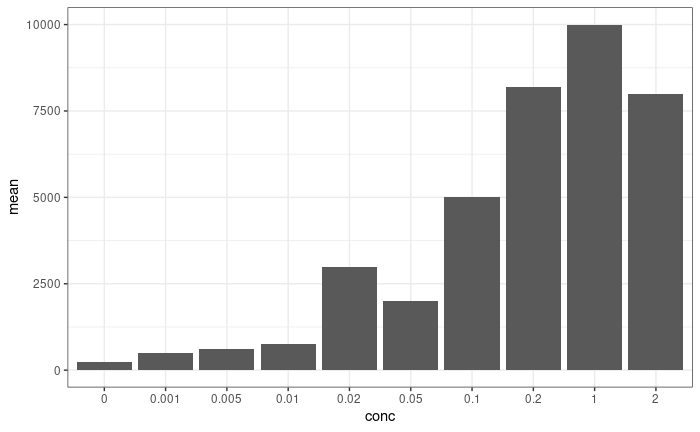

## R 명령어
이번 수업에서는 R을 기반으로 진행하였기 때문에 많은 명령어를 사용하여 원하는 기능을
수행하도록 해보았다. 하지만 처음사용하다보니 대부분의 명령어가 익숙하지 못해 사실상
박사님이 미리 설계해둔 것을 복사 붙여넣기 한 후에 다시 되새기며 이해해보는 수준에 머물렀다.
그렇기 때문에 배웠던 명령어를 정리하고, 기능을 익힘으로써 추후에는 스스로 설계하여 원하는
기능을 수행하도록 할 필요성이 느껴졌다.

* rep: 반복되는 값을 추가하기, rep(x, number)
* c: 데이터나 객채들을 하나로 결합, c(x, y, z ...)
* data.frame: dataframe을 생성, data.frame(x, y, z...)
* class: 데이터 객체 구성요서의 속성 확인, class(x)
* paste0: 나열된 원소 사이에 공백없이 출력, paste0(x, y, z...)
* length: 데이터 객체 요소들의 개수, length(x)
* colnames: 열이름 바꾸기, colnames("x", "y", "z"...)
* ggplot: 그래프 그리기, ggplot(x, aes(x=x, y=y)) + geom+bar(stat="identity") + theme_bw()
* bind_rows: 열을 합치기, bind_row(x, y, z...)
* library: 패키지 다운로드, library(readxl)
* read_excel: 엑셀 불러오기, readxl("excel.xlsx")
* download.file: 파일 다운로드. downlaod.file(url=x, destfile=x.txt)
* dir.create: 폴더 만들기, dir.create("x")
* for: 반복적인 부분 자동화, for(i in x){명령어}
* try: 시도하고 안되도 넘어가기, try(명령어)
* cat: 행을 바꾸지 않은 출력하기, cat(x, y, z...)
* do.call: 리스트를 개별 인자들로 분해하기, do.call(x, y)
* as.numeric: 문자형을 숫자형으로 바꾸기, as.numeric(x)
* as.character: 숫자형을 문자형으로 바꾸기, as.character(x)
* lapply: 주어진 함수 연산을 특정단위로 쉽게할 수 있도록 지원, lapply(x, 명령어)
* if: 문장출려과 다른 명령어 수행, if(조건){Ture 명령어}else{False명령어}
* file.remove: 파일 제거, file.remove(x)
* print: 결과 출력하기, print(x)
* sapply: 주어진 함수 연산을 특정단위로 쉽게할 수 있도록 지원, sapply(x, 명령어)
* left_join: 데이터를 병합할때 왼쪽에 있는 테이블을 기준으로 병합, left_join(x, y, by='')
* full_join: 데이터를 병합할때 모든 데이터를 병합, full_join(x, y, by='')
* select: 열 선택, select(x, y)
* drop_na: 결측치 제거, drop_na()
* filter: 조건에 맞는 데이터만 필터링, filter()
* mutate: 데이터프레임에 조건에 맞는 새로운 열을 만드거나 변경, mutate(x, y)
* group_by: 특정 열을 기준으로 그룹별 집계, group_by(x)
* summarise: 단일 열에 대한 계산, summarise(x = y)

## R markdown
R markdown과 github를 사용해 수업 목표였던 생물학의 고질적인 문제인 낮은 재현성을
해결하기 위하여 여러명이 몇 가지의 Promoter part에 대한 iGem 내에서의 여러 실험들을
주어진 포맷으로 정리를 했다. 그 결과 아래와 같은 그래프를 만들 수 있었습니다.

하지만 위 그래프는 같은 프로모터에 대해 같은 inducer가 같은 농도로 처리된 data를 여러 사람이 수집한 것이 아니기 때문에 애당초의 수업목표를 모두 이루었다고 볼 수는 없습니다. 그래도 1학기 동안의 수업을 통해서 R markdown을 사용하는 것에 대한 의의와 목적성을 알 수 가 있었습니다.

